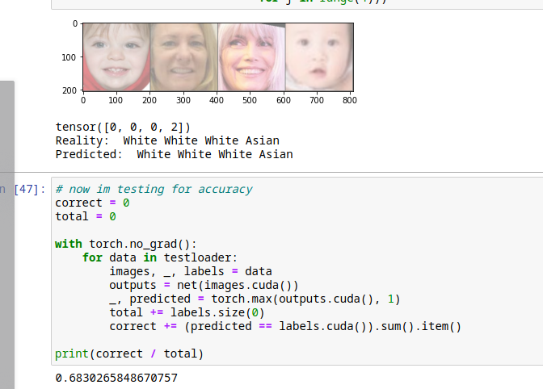
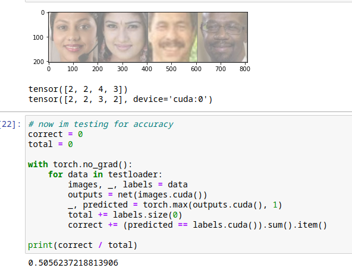
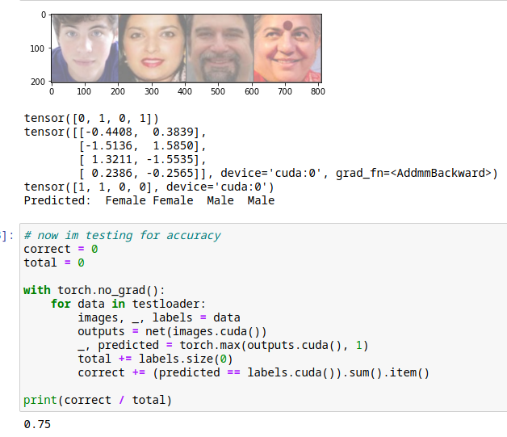

# UTK Dataset in PyTorch

Even though the codebase is relatively small, this project was a MAJOR leap as far as Machine Learning experience goes. It was an awesome exposure to how I can see manipulations of datasets quickly turn into a real life neural network, and how certain things can really be sped up with a GPU (I have a 1660 SUPER).

## Results first try:
2/27/21 - I was able to train a CNN for each age, race, and gender from the ground up, but there are definitely things I want to experiment more with (changing learning rates, loss functions, actual NN architecture - I pooled over with an 8x8 kernel in a 200x200 pixel image lol). It is still super rewarding though :)

I calculated the percentages accuracies I got from each one
### Race
The dataset comes with five race labels - White, Black, Asian, Indian, and Other (presumably for latinx, arab, etc.). In the future, I want to try this with a more expansive dataset (more labels)

### Age
Really the unique thing is that I didn't train it to recognize an exact year, but rather a range of years (20-24), (55-59), etc. 

### Gender
This one was binary and I wanted to use Binary Cross Entropy loss, but I had some issues so I ended up using Categorical again, I want to change this once I start to really understand what's going on between the scenes.

